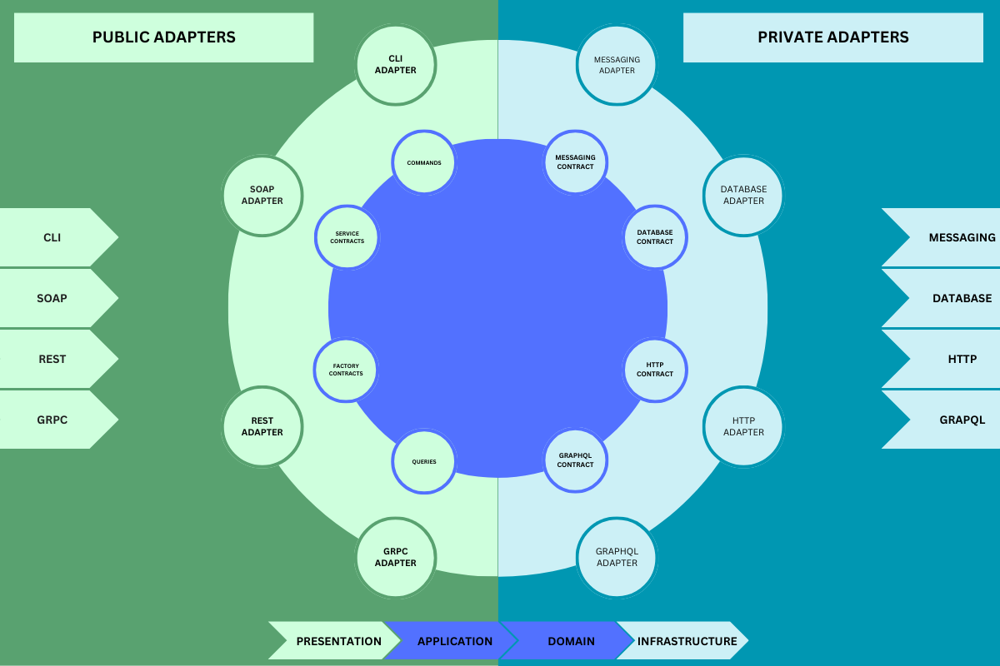
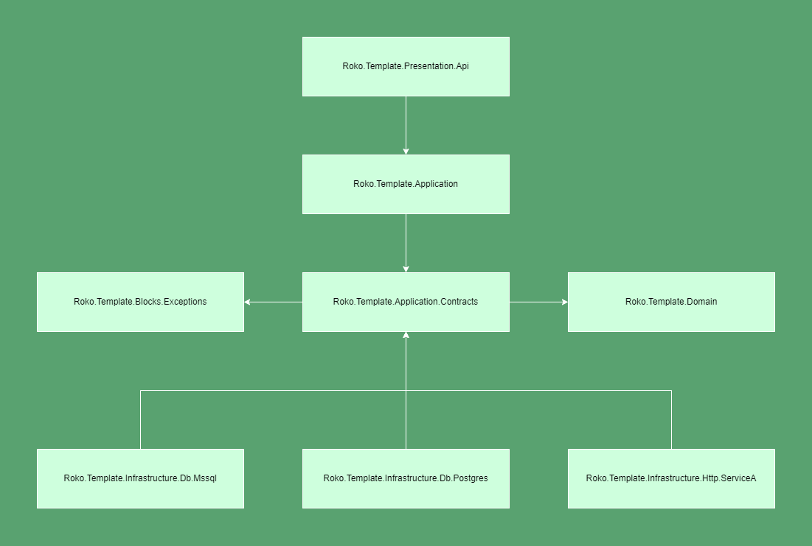

## Table of contents
- [Overview](#overview)
- [Introduction](#introduction)
- [Project structure](#project-structure)
  - [Application](#application-layer)
  - [Blocks](#blocks-layer)
  - [Domain](#domain-layer)
  - [Infrastructure](#infrastructure-layer)
  - [Presentation](#presentation-layer)
- [Running project](#running-project)
- [Installing template](#installing-template)
- [Using template](#using-template)

# Overview


# Introduction

This is a project template for creating .NET Core Web Api applications using .NET 8.0. Template is build using Onion Architecture (https://jeffreypalermo.com/2008/07/the-onion-architecture-part-1/). Main focus is to separate different infrastructure problems from an actual business requirements which is done by leveraging **Dependency Inversion Principal**.

Purpose of this approach is to easily distinguish different systems our application is communicating with by simply looking at folder structure. If you take a closer look at our infrastructure layer, you should immediately notice what is used as storage.

# Project structure



## Application Layer

Defines the jobs the software is supposed to do and directs the expressive domain objects to work out problems. The tasks this layer is responsible for are meaningful to the business or necessary for interaction with other systems.

This layer consist of two .NET libraries:
- Roko.Template.Application
- Roko.Template.Application.Contracts

### Roko.Template.Application.Contracts

This is where we are defining contracts our **Roko.Template.Application** Layer needs in order to communicate with Infrastructure layer.

**This layer only includes models and interfaces.**

### Roko.Template.Application

This is where all business logic should happen. We are doing this by leveraging **MediatR** commands and queries, which nicely adhere to the **Separation of Concerns Principle**. In order to communicate with database or any other system, we are using interfaces we define in **Roko.Template.Application.Contracts** to achieve this.
We use **FluentValidation** to validate our commands and queries, which complements **MediatR** well.

## Blocks Layer

This layers consists of helper classes that are used in one or more .NET libraries. Good examples are when you need specific exceptions in Presentation and Infrastructure layer or you have some extension methods on native .NET types. (eg. List extensions)


## Domain Layer

 Responsible for representing concepts of the business, information about the business situation, and business rules. The state that reflects the business situation is controlled and used here, while the technical details of storing it are delegated to the infrastructure. This layer is the foundation of business software.

This is where you would keep your domain objects.

## Infrastructure Layer

The infrastructure layer is how the data that is initially held in domain entities (in memory) is persisted in databases or another persistent store. An example is using Entity Framework Core code to implement the Repository pattern classes that use a DBContext to persist data in a relational database.

This is where your implementation of contracts lives.

Also, it is always a good practice to have multiple packages in your Infrastructure layer to create better separation between systems you are communicating with.

For example, let's say that your application needs data from multiple data sources:
- MSSQL database called "First"
- MSSQL database called "Second"
- POSTGRES database called "Third"
- HTTP Api database called "Four"

For each of those sources you would create a separate library and put your implementation there.
- Roko.Template.Infrastructure.Db -> You need to have something shared between all db libraries
- Roko.Template.Infrastructure.Db.Mssql -> you need something shared between First and Second
- Roko.Template.Infrastructure.Db.Mssql.First
- Roko.Template.Infrastructure.Db.Mssql.Second
- Roko.Template.Infrastructure.Db.Postgres.Third
- Roko.Template.Infrastructure.Http.Four

This helps to keep your dependencies clean.


## Running project

- Clone repository
- Open Roko.Template.sln
- In Visual Studio Solution Explorer navigate to src
    - Right click on Roko.Template
    - Click on **Set as Startup Project**
    - Click on **Manage User Secrets#**
- In Rider
    - In upper right corner select Roko.Template as a startup project
    - In Solution Explorer right-click on Roko.Template
    - Click on **Tools > .Net User Secrets**
- Add the following secrets

//#if (Postgres)
For Postgres SQL:
```
{
  "PostgresSettings:ConnectionString": "User ID=postgres; Password=yourStrong(!)Password;Host=localhost; Port=5432; Database=RokoTemplateDatabase"
}
```
//#endif

//#if (MsSql)
For MS SQL Server:
```
{
  "MssqlSettings:ConnectionString": "Server=localhost; Database=RokoTemplateDatabase;User Id=SA;Password=yourStrong(!)Password;TrustServerCertificate=Yes"
}
```
//#endif

> On Windows, user secrets are saved in `%APPDATA%\Microsoft\UserSecrets\<user_secrets_id>\secrets.json` and on Linux and Mac, in `~/.microsoft/usersecrets/<user_secrets_id>/secrets.json`. If the environment variable `APPDATA` is found during runtime on a Linux system, the file is searched for in the Windows location. The variable could have been added to your system for a variety of reasons. If so, copy `~/.microsoft/usersecrets/<user_secret_id>` folder to `%APPDATA%/Microsoft/UserSecrets`.
> 
> The only difference between user secrets and other configuration data is that they are not tracked in version control. Otherwise, they function as configuration files. So, one possible solution is to add values to environment variables, which are also not stored in version control.

- In Roko.Template folder
    - open terminal
    - execute the following command
```
docker compose up
```

> When the template is launched, Docker images for both the Postgres and MsSql databases are started. The template also includes the Entity Framework Core packages, which are required for working with both MsSql and Postgres. To test the template with either, use the preprocessor constants; the default is MyDb which uses Postgres.
>
> When instances of solutions are generated from the template, only one database container and corresponding package are used.

-  Start your application from IDE

## Installing template

This will create your template for later usage via .NET CLI tools

- In Roko.Template folder
  - Open terminal and run
```
  dotnet new install .
```
- To check if your template named roko-api is installed run
```
dotnet new --list
```

> If your template isn't listed, try restarting the terminal (close and reopen).

## Using template

- First, install template
- Navigate to folder where you want to install template
- Run
```
dotnet new roko-api -n Roko.FirstProject
```
- Check if your project is generated correctly