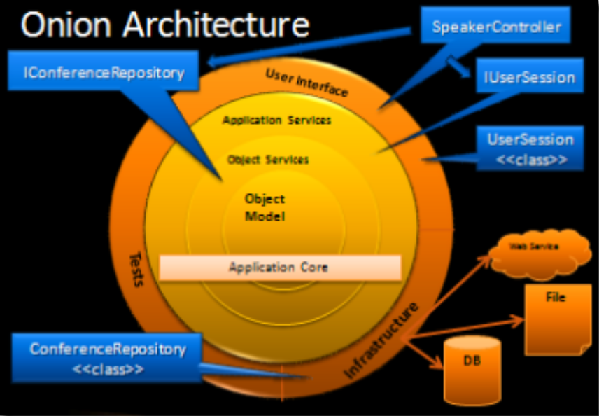
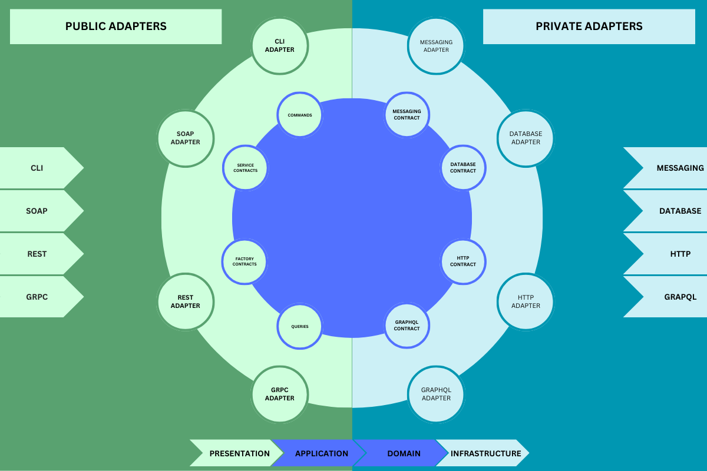
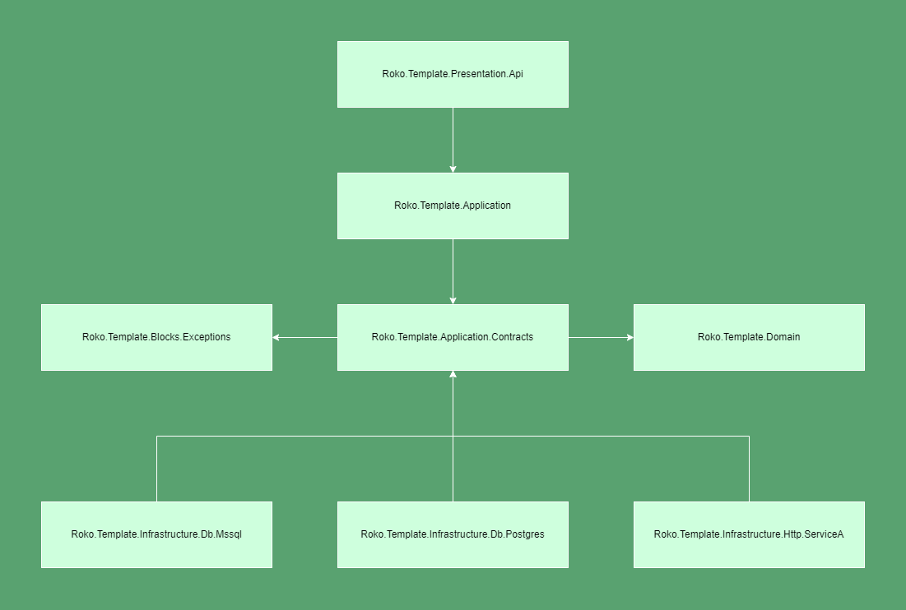

## Table of contents
- [Introduction](#introduction)
  - [Architecture Explained](#architecture-explained)
- [Project structure](#project-structure)
  - [Application](#application-layer)
  - [Blocks](#blocks-layer)
  - [Domain](#domain-layer)
  - [Infrastructure](#infrastructure-layer)
  - [Presentation](#presentation-layer)
- [Running project](#running-project)
- [Installing template](#installing-template)
- [Using template](#using-template)

# Introduction

This is a (template project for creating) .NET Core Web Api application based on .NET 8.0. The solution consists of application fundamentals such as web API presentation, application and domain layers, an Entity Framework Core database layer, some common application blocks, and a number of automated tests. The setup of Docker containers is also included.

The solution is built using Onion Architecture (https://jeffreypalermo.com/2008/07/the-onion-architecture-part-1/), which results in more maintainable applications by emphasizing separation of concerns throughout the system. It emphasizes the use of interfaces for behavior contracts while forcing infrastructure to be externalized. This leads to the separation of different infrastructure problems from actual business requirements.

The solution and project structures make it easy to distinguish between different components of the application by just looking at folder structure. For example, if you look closely at a infrastructure solution folder, you will see what is used for storage.

## Architecture Explained
The architecture diagram reminds you of onions. The central premise is that it controls coupling. The fundamental rule is that all code can rely on more central layers, but not on layers further away from the core. In other words, all coupling occurs toward the center. This architecture is biased toward object-oriented programming, and it prioritizes objects over all others.



The number of layers in the application core will vary, but keep in mind that the Domain Model is at the very center, and because all coupling occurs toward the center, the Domain Model is only coupled to itself. The first layer around the Domain Model typically contains interfaces that provide object saving and retrieving behavior, known as repository interfaces. The object saving behavior, however, is not part of the application's core because it typically involves a database. Only the interface is located in the application core. Out on the edges, we see UI, Infrastructure, and Tests.

The outer layer is reserved for items that may change frequently. These components should be intentionally separated from the application core. On the outer edges, we will find a class that implements a repository interface. This class is tied to a specific method of data access, which is why it lives outside of the application core. This class implements the repository interface and is thus bound to it.

The application core requires the implementation of core interfaces, and if those implementing classes are located at the application's edges, we need a mechanism for injecting that code at runtime so that the application can perform useful functions. This is why Onion Architecture is heavily reliant on the **Dependency Inversion Principle**.

This general description corresponds to a more detailed architecture diagram of this application's technology stack.


# Project structure



## Application Layer

Defines the jobs the software is supposed to do and directs the expressive domain objects to work out problems. The tasks this layer is responsible for are meaningful to the business or necessary for interaction with other systems.

This layer consist of two .NET libraries:
- Roko.Template.Application
- Roko.Template.Application.Contracts

### Roko.Template.Application.Contracts

This is where we are defining contracts our **Roko.Template.Application** Layer needs in order to communicate with Infrastructure layer.

**This layer only includes models and interfaces.**

### Roko.Template.Application

This is where all business logic should happen. We are doing this by leveraging **MediatR** commands and queries, which nicely adhere to the **Separation of Concerns Principle**. In order to communicate with database or any other system, we are using interfaces we define in **Roko.Template.Application.Contracts** to achieve this.
We use **FluentValidation** to validate our commands and queries, which complements **MediatR** well.

## Blocks Layer

This layers consists of helper classes that are used in one or more .NET libraries. Good examples are when you need specific exceptions in Presentation and Infrastructure layer or you have some extension methods on native .NET types. (eg. List extensions)


## Domain Layer

 Responsible for representing concepts of the business, information about the business situation, and business rules. The state that reflects the business situation is controlled and used here, while the technical details of storing it are delegated to the infrastructure. This layer is the foundation of business software.

This is where you would keep your domain objects.

## Infrastructure Layer

The infrastructure layer is how the data that is initially held in domain entities (in memory) is persisted in databases or another persistent store. An example is using Entity Framework Core code to implement the Repository pattern classes that use a DBContext to persist data in a relational database.

This is where your implementation of contracts lives.

Also, it is always a good practice to have multiple packages in your Infrastructure layer to create better separation between systems you are communicating with.

For example, let's say that your application needs data from multiple data sources:
- MSSQL database called "First"
- MSSQL database called "Second"
- POSTGRES database called "Third"
- HTTP Api database called "Four"

For each of those sources you would create a separate library and put your implementation there.
- Roko.Template.Infrastructure.Db -> You need to have something shared between all db libraries
- Roko.Template.Infrastructure.Db.Mssql -> you need something shared between First and Second
- Roko.Template.Infrastructure.Db.Mssql.First
- Roko.Template.Infrastructure.Db.Mssql.Second
- Roko.Template.Infrastructure.Db.Postgres.Third
- Roko.Template.Infrastructure.Http.Four

This helps to keep your dependencies clean.


## Running project

- Clone repository
- Open Roko.Template.sln
- In Visual Studio Solution Explorer navigate to `src` folder
    - Right click on Roko.Template
    - Click on **Set as Startup Project**
    - Click on **Manage User Secrets**
- In Rider
    - In upper right corner select Roko.Template as a startup project
    - In Solution Explorer right-click on Roko.Template
    - Click on **Tools > .Net User Secrets**
- Add the following secrets

<!--#if (Postgres)-->
For Postgres:
```
{
  "PostgresSettings:ConnectionString": "User ID=postgres; Password=yourStrong(!)Password;Host=localhost; Port=5432; Database=RokoTemplateDatabase"
}
```
<!--#endif-->
<!--#if (MsSql)-->
For Microsoft SQL Server:
```
{
  "MssqlSettings:ConnectionString": "Server=localhost; Database=RokoTemplateDatabase;User Id=SA;Password=yourStrong(!)Password;TrustServerCertificate=Yes"
}
```
<!--#endif-->

> On Windows, user secrets are saved in `%APPDATA%\Microsoft\UserSecrets\<user_secrets_id>\secrets.json` and on Linux and Mac, in `~/.microsoft/usersecrets/<user_secrets_id>/secrets.json`. If the environment variable `APPDATA` is found during runtime on a Linux system, the file is searched for in the Windows location. The variable could have been added to your system for a variety of reasons. If so, copy `~/.microsoft/usersecrets/<user_secret_id>` folder to `%APPDATA%/Microsoft/UserSecrets`.
> 
> The only difference between user secrets and other configuration data is that they are not tracked in version control. Otherwise, they function as configuration files. So, one possible solution is to add values to environment variables, which are also not stored in version control.

- In Roko.Template folder
    - open terminal
    - execute the following command
```
  docker compose up
```

<!--#if(false)-->
> When the template is launched, Docker images for both the Postgres and MsSql databases are started. The template also includes the Entity Framework Core packages, which are required for working with both MsSql and Postgres. To test the template with either, use the preprocessor constants; the default is MyDb which uses Postgres.
>
> When instances of solutions are generated from the template, only one database container and corresponding package are used.
<!--#endif-->

-  Start your application from IDE

<!--#if(false)-->
## Testing template
The template solution includes support for both Postgres and MsSql databases. Postgres is the default. You should be able to start the template application against a containerized Postgres database without changing a thing.

The template solution includes automated tests at the architectural, integration, and unit levels. All tests should be able to run locally on the development machine. When tests are started, a containerized database is created, which requires Docker Desktop to be installed.

You should be able to run automated tests and experiment with the application that connects to Microsoft SQL as well. Use the following steps to setup MsSql:
1. Change `MyDb` to `MsSql` in the `TargetDatabase` property of the `Directory.Build.props` file in solution folder.
2. To fix migrations, delete them and create a new `InitialCreate` migration.

## Installing
The `README.md` file in the parent folder contains instructions for installing the template package. This template will be added alongside the others when a corresponding `nupkg` is installed. After the installation, this template can be found under the short name `roko-api`. Use `dotnet new list` to check if the template is installed.

### Installation from file system (debug scenario)
- In Roko.Template folder, open terminal and run
- Open terminal in solution root folder and run
```
  dotnet new install .
```
- To check if your template named roko-api is installed run
```
  dotnet new list
```

> If your template isn't listed, try restarting the terminal (close and reopen).

## Using template

- First, install template
- Navigate to folder where you want to create a solution from the template
- Run
```
  dotnet new roko-api -n Roko.FirstProject
```
- Optionally, if you want a solution with a specific database, use the following command.
```
  dotnet new roko-api -n Roko.FirstProject --Database MsSql
```
- The following command will provide you with information about the template's options.
```
  dotnet new roko-api --help
```
- Check if your project was correctly generated by opening and building the solution. When you try to start the project, you will receive an error message indicating that the database creation failed.
- Add "InitialCreate" Entity Framework migration
<!--#endif-->
